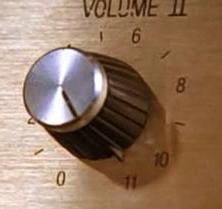
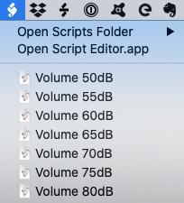

# Speaker Loudness Calibration

Home studio sound depends upon good audio and loudness is critical to the quality.  We all like it louder but getting balanced sound is about calibration and control.

  Nigel Tufnel: _"These go to eleven"_

Our ears hear the balance of bass-mid-high frequencies differently at different volume. Higher volumes tend to pump the bass. So, to get good mixes and masters, it's important to calibrate the loudness of your entire system. That includes the audio generator, computer, audio interface, amplifier, speakers and whatever else you might have in the chain.

This project provides a simple set of tools to achieve this using simple software and calibration using a mobile phone or a proper Decibel meter if you have one (I don't).

This following from the blog [How Loud Should You Mix?](https://www.sweetwater.com/insync/how-loud-should-you-mix/) by Sweetwater.

In the last steps I use MacOS scripts to conveniently find and set my system volume. It would be great for somebody to submit something similar for Windows.

## Contents

1. [About pink noise](#about-pink-noise)
1. [Create a pink noise file at -20dB](#pink-noise-file-at--20db)
1. [Loudness measurement tool](#loudness-measurement-tool)
1. [Measurement procedure](#measurement-procedure)
1. [MacOS scripts](#macos-scripts)
1. Enjoy your calibrated sound!

### About Pink Noise

[Pink noise](https://en.wikipedia.org/wiki/Pink_noise) is a random noise wth a frequency spectrum with equal power/loudness in each octave. Pink noise is common in natural environments (or close to pink noise spectrum).

Pink noise is well-suited to balancing audio systems. This YouTube video on [Pink Noise vs. White Noise](https://www.youtube.com/watch?v=yewKyMgd1Xk) explains it from a sound engineer's perspective.

## Pink noise file at -20dB

We need a pink noise recording with an RMS energy of -20dB.

Here's a [30sec pink noise wavefile](audio/pinknoise-20dB.wav) I baked earlier.

Or you can bake your own...
* [Using Audacity](create-pink-noise-audacity.md) (free, open source, cross-platform audio software)
* [Using your DAW](create-pink-noise-logic.md) (instructions provided for Logic Pro)

## Loudness measurement tool

We need a reasonably accurate measurement of sound pressure level (SPL).

* Borrow or buy a Decibel meter. There are many sites that review and recommendation meters at different price points.
* Install a [good SPL meter on your smartphone](smartphone-sound-level.md).

I used [SoundMeter Basic 2018](https://apps.apple.com/au/app/soundmeter-basic-2018/id1457367090) on my iPhone 11 because...

1. It's free and simple
1. The US CDC found it's measurements to be very good in [this article](https://blogs.cdc.gov/niosh-science-blog/2014/04/09/sound-apps/)

The settings should be something like:

* C-Weighting (calibration oriented to human hearing with a some bias towards bass)
* Slow response (for average sound level)
* Level type of "Lp" (exponential time-weighted average level). It seems not all meters have this.

## Measurement Procedure

First, determine how you will adjust volume. It might be the volume setting on the computer, setting for the audio interface, amplifier volume or something else in your.

**Important**: if you change _anything_ in that chain then the volume calibration will be off. Don't let anyone mess with your settings!

Target: 60dB SPL (normal conversation volume)

1. Turn down your system volume (way down)
1. Play and loop your pink noise file
1. Pan the output to the LEFT channel
1. Hold you sound meter in your normal listening position
1. Adjust the volume until the SoundMeter reads around 60.0dB
1. Repeat for the RIGHT channel
1. If left and right volumes are inconsistent then consider adjusting the amplifier balance or speaker volume
1. Repeat until LEFT-pan and RIGHT-pan produce 60.0dB at the same system volume
1. Record the volume calibration for 60dB. This might be a mark on volume dial of your amp, system volume or whatever.

Repeat the calibration for a range of SPL: 60dB, 65dB, 70dB, 75dB, 80dB, 85dB.

Here's my calibration table. Your's will be different.

| SPL | MacOS Volume |
| --- | --- |
| 65dB | 78 |
| 70dB | 84 |
| 75dB | 93 |
| 80dB | 100 |
| 85dB | my system doesn't go to 11 |

## MacOS Scripts

If you're on MacOS, then you can use AppleScript to record and later set your system volume. Follow these [instructions](volume-scripts.md) to create a convenient menu bar item to reliably set your system volume.

## My Setup

It's basic but it works

1. My home office. It's not well padded but it's what I've got.
1. MacBook Pro 13" 2020 model (before the M1)
1. Audio Interface: [Audient EVO 8 USB Audio](https://evo.audio/products/evo-8/overview/)
1. Speakers: [JBL LSR305P MKII 5" Powered Studio Monitors](https://jblpro.com/products/305p-mkii) (Pair)
1. Stand: about 120cm high with 1cm neoprene for a little isolation
1. Calibration: [Sonarworks SoundID Reference](https://www.sonarworks.com/soundid-reference) enabled with calibration for the speakers and room

## References

* Wikipedia: [Pink noise](https://en.wikipedia.org/wiki/Pink_noise)
* YouTube: [Pink Noise vs. White Noise](https://www.youtube.com/watch?v=yewKyMgd1Xk)
* Sweetwater: [How Loud Should You Mix?](https://www.sweetwater.com/insync/how-loud-should-you-mix/)
* Center for Disease Control: [So How Accurate Are These Smartphone Sound Measurement Apps?](https://blogs.cdc.gov/niosh-science-blog/2014/04/09/sound-apps/)
