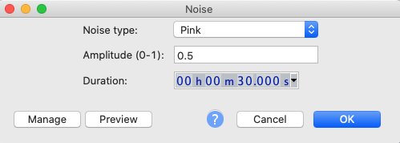
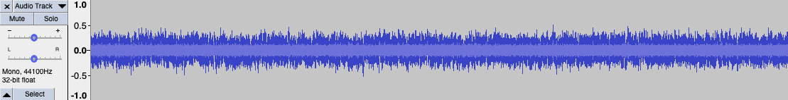
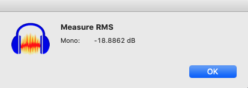
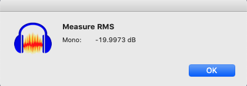

# Speaker Loudness Calibration

Home studio sound depends upon good audio and loudness is critical to the quality.  We all like it louder but getting balanced sound is about calibration and control.

Our ears hear the balance of bass-mid-high frequencies differently at different volume. Higher volumes tend to pump the bass. So, to get good mixes and masters, it's important to calibrate the loudness of you entire system -- from audio generator, through your computer, audio interface, amplifier, speakers and whatever else you might have in the chain.

This project provides a simple set of tools to achieve this using simple software and calibration using a mobile phone (or a proper Decibel meter if you have one).

This following from the blog [How Loud Should You Mix?](https://www.sweetwater.com/insync/how-loud-should-you-mix/) by Sweetwater.

In the last steps I use MacOS tools to find my system volume. It would be great for somebody to submit something similar for Windows.

1. [Create a pink noise file at -20dB](#create-a-pink-noise-file-at--20db-create-pink-noise)
2. Loudness measurement tool (or mobile phone approximation)
3. Measure loudness
4. Setup loudness scripts
5. Enjoy your calibrate sound!

## Create a pink noise file at -20dB

We need a pink noise recording with an RMS energy of -20dB.

Here's a [30sec pink noise wavefile](audio/pinknoise-20dB.wav) I baked earlier. Or you can bake your own...

### About Pink Noise

[Pink noise](https://en.wikipedia.org/wiki/Pink_noise) is a random noise wth a frequency spectrum with equal power/loudness in each octave. Pink noise is common in natural environments (or close to pink noise spectrum).

Pink noise is well-suited to balancing audio systems. This YouTube video on [Pink Noise vs. White Noise](https://www.youtube.com/watch?v=yewKyMgd1Xk) explains it from a sound engineer's perspective.

### Using Audacity

Using [Audacity](https://www.audacityteam.org/) (free, open source, cross-platform audio software)

1. Select menu Generate ➜ Noise
1. Select noise type of "Pink". I used amplitude of 0.5 and 30 second but you can use other settings. Click OK.

1. The editor window will show show a random-looking waveform. Because it's random, it will be a little different each time.

1. Select the entire waveform. (Before playing it, turn down your speaker volume just in case.)
1. Select menu Analyze ➜ Measure RMS to adjust the volume/energy. This analysis tool is not enabled by default. If you don't see Measure RMS in the Analyze menu then follow the [Audicity Measure RMS](https://manual.audacityteam.org/man/measure_rms.html) instructions.
1. This analysis tells us that the RMS energy is -18.886dB which is just a little above our target of -20dB. So, we need to reduce the amplitude by just -1.11dB. Click OK to close the measurement popup.

1. Select menu Effect ➜ Amplify. Enter the amplitude change and click OK. You'll notice that the waveform's amplitude will get a little smaller (or larger if you have a positive correction).

1. Repeat the Analyze ➜ Measure RMS measurement. You should see a figure quite close to -20dB.

1. Save your .WAV file using the menu File ➜ Export ➜ Export as WAV.  16-bit should be for this calibration but feel free to use something higher. A lossless format like WAV is recommended over compressed formats like MP3.

### Using a DAW

Here's an example using Logic Pro on MacOS. There are similar methods for other DAWs.

1. Create an instrument using Utilities ➜ Test Oscillator (mono)
1. Select the test tone as "Pink Noise"
1. On the Master Bus, add Metering ➜ MultiMeter to get an RMS meter (it should be mono)
1. Find the RMS mono meter on the far right of the Analyzer
1. Adjust the Level in the Test Oscillator until the RMS is close to -20.0dB. Important: the RMS shows the historical peak, so you will need to close on the RMS level regularly to reset and obtain the current RMS.
1. Note that because the oscillator is pink noise, the spectrum should be relatively flat. (Switch to white noise for a very different sound and spectrum)
1. Bounce or save a WAV file with 30sec of pink noise.

Note: in the image below I also loaded the pink noise generated by Audacity and compared it to the test oscillator to validate the RMS energy was also close to -20db.

## References

* Wikipedia: [Pink noise](https://en.wikipedia.org/wiki/Pink_noise)
* Sweetwater: [How Loud Should You Mix?](https://www.sweetwater.com/insync/how-loud-should-you-mix/)
