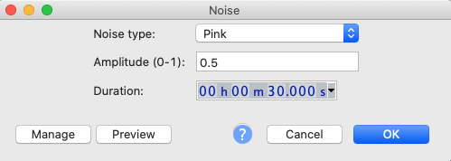
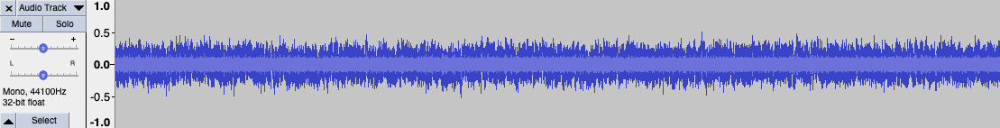
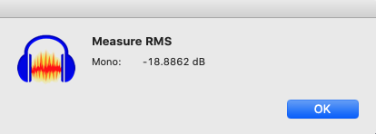
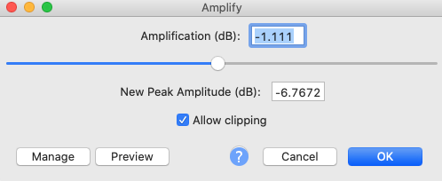

# Create a Pink Noise file using Audacity

We need a pink noise recording with an RMS energy of -20dB.

[Audacity](https://www.audacityteam.org/) is free, open source, cross-platform audio software.

1. Select menu Generate ➜ Noise
1. Select noise type of "Pink". I used amplitude of 0.5 and 30 second but you can use other settings. Click OK.

1. The editor window will show show a random-looking waveform. Because it's random, it will be a little different each time.

1. Select the entire waveform. (Before playing it, turn down your speaker volume just in case.)
1. Select menu Analyze ➜ Measure RMS to adjust the volume/energy. This analysis tool is not enabled by default. If you don't see Measure RMS in the Analyze menu then follow the [Audicity Measure RMS](https://manual.audacityteam.org/man/measure_rms.html) instructions.
1. This analysis tells us that the RMS energy is -18.886dB which is just a little above our target of -20dB. So, we need to reduce the amplitude by just -1.11dB. Click OK to close the measurement popup.

1. Select menu Effect ➜ Amplify. Enter the amplitude change and click OK. You'll notice that the waveform's amplitude will get a little smaller (or larger if you have a positive correction).

1. Repeat the Analyze ➜ Measure RMS measurement. You should see a figure quite close to -20dB.

1. Save your .WAV file using the menu File ➜ Export ➜ Export as WAV.  16-bit should be for this calibration but feel free to use something higher. A lossless format like WAV is recommended over compressed formats like MP3.
