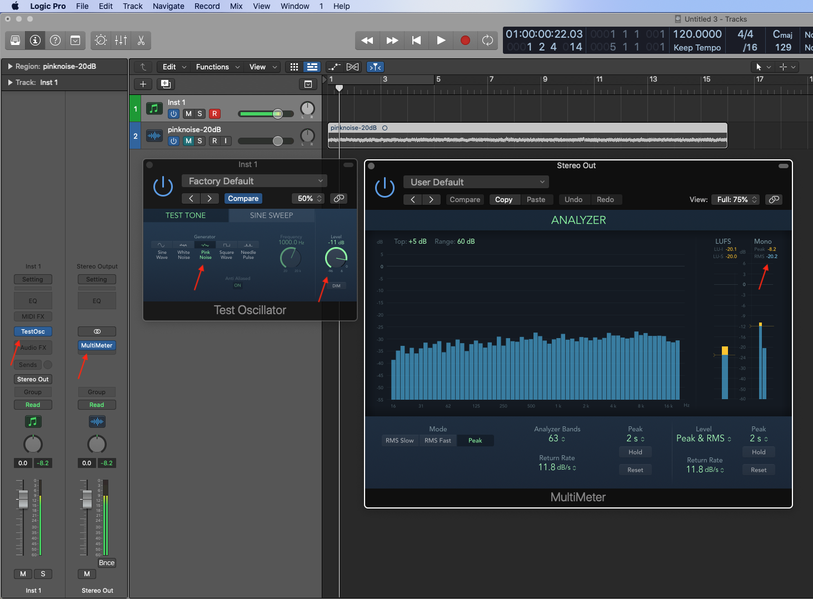

# Create a Pink Noise file using a DAW

We need a pink noise recording with an RMS energy of -20dB.

Here's an example using Logic Pro on MacOS. There are similar methods for other DAWs.

1. Create an instrument using Utilities ➜ Test Oscillator (mono)
1. Select the test tone as "Pink Noise"
1. On the Master Bus, add Metering ➜ MultiMeter to get an RMS meter (it should be mono)
1. Find the RMS mono meter on the far right of the Analyzer
1. Adjust the Level in the Test Oscillator until the RMS is close to -20.0dB. Important: the RMS shows the historical peak, so you will need to close on the RMS level regularly to reset and obtain the current RMS.
1. Note that because the oscillator is pink noise, the spectrum should be relatively flat. (Switch to white noise for a very different sound and spectrum)
1. Bounce or save a WAV file with 30sec of pink noise.

Note: in the image below I also loaded the pink noise generated by Audacity and compared it to the test oscillator to validate the RMS energy was also close to -20db.

